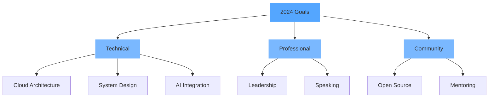

<div align="center">
  
</div>

<br/>

<p align="center">
  
</p>

> 🚀 Senior Frontend Developer with 4+ years of experience in building scalable web applications

## Tech Stack

```typescript
const tech = {
  frontend: {
    main: ['React', 'Next.js', 'TypeScript'],
    styling: ['Tailwind CSS', 'Styled Components'],
    state: ['Redux', 'Zustand', 'React Query'],
  },
  backend: {
    runtime: 'Node.js',
    frameworks: ['NestJS', 'Express'],
    databases: ['PostgreSQL', 'MongoDB'],
  },
  cloud: ['AWS', 'Firebase', 'Vercel'],
  tools: ['Docker', 'Git', 'Figma'],
}
```

<div align="center">
  
</div>

## Stats & Activity

<table align="center">
  <tr>
    <td>
      
    </td>
    <td>
      
    </td>
  </tr>
</table>

## Current Focus



## Featured Work

<div align="center">
  <table>
    <tr>
      <td width="50%">
        <a href="https://github.com/hoangtuanphong1a/project1">
          
        </a>
      </td>
      <td width="50%">
        <a href="https://github.com/hoangtuanphong1a/project2">
          
        </a>
      </td>
    </tr>
  </table>
</div>

## Let's Connect

<div align="center">
  
[](https://linkedin.com/in/yourprofile)
[](https://twitter.com/yourprofile)
[](mailto:your.email@example.com)

</div>

---

<div align="center">
  <sub>💡 Open to collaboration and new opportunities</sub>
</div>

<div align="center">
  
</div>
