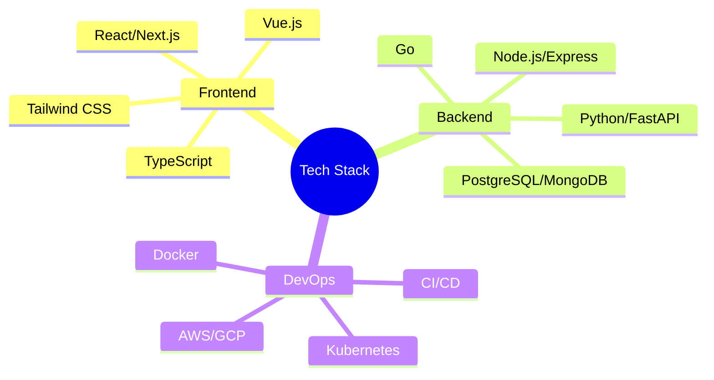

#  Full Stack Developer | Tech Enthusiast

<div align="center">
  
</div>

## 🚀 About Me

```typescript
const developer = {
  name: "Your Name",
  role: "Full Stack Developer",
  location: "Your Location 🌍",
  languages: ["TypeScript", "Python", "Go", "Java"],
  currently: {
    learning: ["Rust", "WebAssembly", "AI/ML"],
    working_on: "Building scalable cloud-native applications",
    looking_for: "Collaboration on innovative projects"
  }
};
```

## 💻 Tech Arsenal

<details>
<summary><b>🎯 Core Technologies</b></summary>


</details>

<details>
<summary><b>🌟 Expertise Areas</b></summary>

- **Architecture Design**
  - Microservices
  - Event-Driven Systems
  - Serverless Applications
  
- **Development Practices**
  - Clean Architecture
  - Test-Driven Development
  - CI/CD Implementation
  
- **Cloud & Infrastructure**
  - AWS Solution Design
  - Kubernetes Orchestration
  - Infrastructure as Code
</details>

## 📊 GitHub Analytics

<div align="center">
  
  
</div>

<div align="center">
  
  
</div>

## 🎯 Featured Projects

<table>
  <tr>
    <td width="50%">
      <h3 align="center">Project 1</h3>
      <div align="center">
        
        <p>
          <a href="https://github.com/yourusername/project1">
            
          </a>
          <a href="https://project1-demo.com">
            
          </a>
        </p>
        <p><strong>Tech Stack:</strong> React, Node.js, MongoDB</p>
      </div>
    </td>
    <td width="50%">
      <h3 align="center">Project 2</h3>
      <div align="center">
        
        <p>
          <a href="https://github.com/yourusername/project2">
            
          </a>
          <a href="https://project2-demo.com">
            
          </a>
        </p>
        <p><strong>Tech Stack:</strong> Vue.js, FastAPI, PostgreSQL</p>
      </div>
    </td>
  </tr>
</table>

## 🤝 Let's Connect

<div align="center">
  <a href="https://linkedin.com/in/yourusername">
    
  </a>
  <a href="https://twitter.com/yourusername">
    
  </a>
  <a href="https://dev.to/yourusername">
    
  </a>
  <a href="mailto:your.email@example.com">
    
  </a>
</div>

<div align="center">
  
</div>
