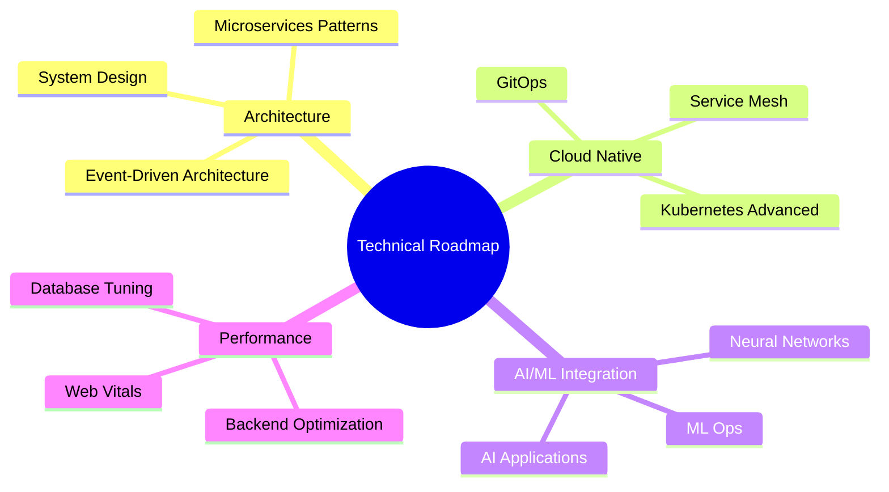
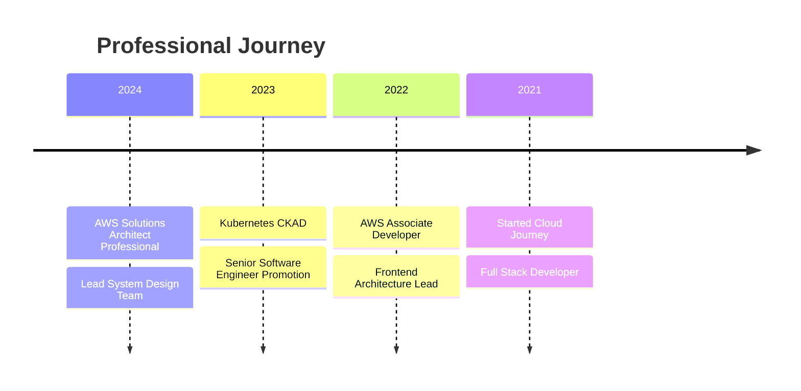
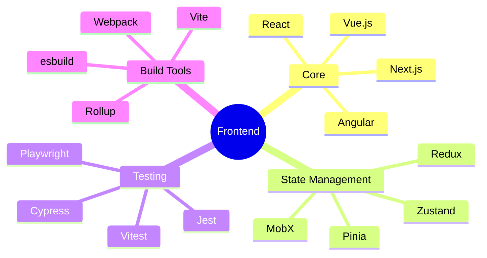
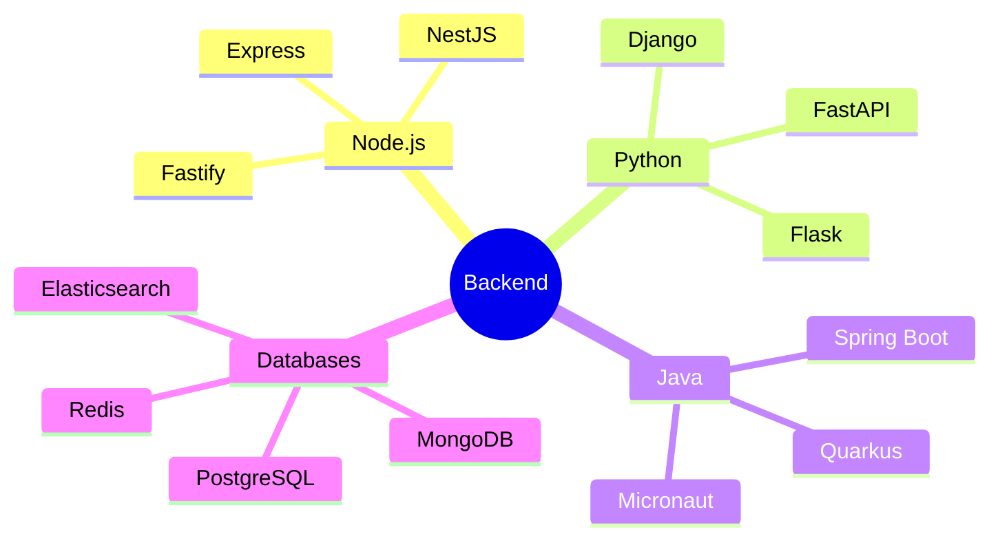
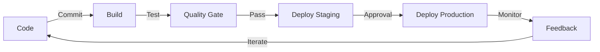
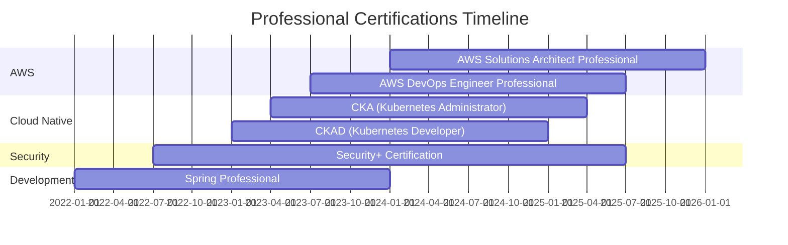

<div align="center">
  

  [](https://badges.pufler.dev)
  [](https://badges.pufler.dev)
  [](https://badges.pufler.dev)
</div>

## 💫 Professional Summary

```typescript
const techProfile = {
  role: "Senior Software Engineer",
  experience: "4+ years",
  mainStack: {
    frontend: {
      frameworks: ["React", "Next.js", "Vue.js"],
      stateManagement: ["Redux", "Zustand", "React Query"],
      styling: ["Tailwind CSS", "Styled-Components", "Material UI"],
      testing: ["Jest", "React Testing Library", "Cypress"]
    },
    backend: {
      languages: ["Node.js", "Python", "Java"],
      frameworks: ["NestJS", "Express", "Spring Boot"],
      databases: {
        sql: ["PostgreSQL", "MySQL"],
        nosql: ["MongoDB", "Redis"],
        orm: ["Prisma", "TypeORM"]
      }
    },
    devops: {
      containerization: ["Docker", "Kubernetes"],
      cicd: ["GitHub Actions", "Jenkins", "GitLab CI"],
      monitoring: ["Grafana", "Prometheus", "ELK Stack"]
    },
    cloud: {
      aws: ["EC2", "S3", "Lambda", "ECS", "RDS"],
      others: ["GCP", "Firebase", "Vercel"]
    },
    architecture: ["Microservices", "Event-Driven", "DDD", "CQRS"]
  },
  certifications: [
    "AWS Certified Solutions Architect",
    "Kubernetes CKAD",
    "HashiCorp Terraform Associate"
  ]
};
```

## 🛠 Technical Expertise

<details>
<summary>Frontend Development</summary>

### Core Technologies


### State Management & Data Fetching


### Styling & UI


### Testing


</details>

<details>
<summary>Backend Development</summary>

### Core


### Databases


### API


</details>

<details>
<summary>DevOps & Cloud</summary>

### Containerization & Orchestration


### CI/CD


### Cloud Platforms


</details>

## 📊 Development Metrics

<div align="center">
  
  
</div>

## 🎯 Technical Focus 2024



## 🚀 Featured Projects

<div align="center">
  <a href="https://github.com/hoangtuanphong1a/ecommerce-platform">
    
  </a>
  <a href="https://github.com/hoangtuanphong1a/microservices-architecture">
    
  </a>
</div>

## 📚 Latest Technical Blog Posts

<!-- BLOG-POST-LIST:START -->
- [Implementing Event-Driven Architecture with AWS EventBridge](https://dev.to/hoangtuanphong1a)
- [Advanced React Patterns for Enterprise Applications](https://dev.to/hoangtuanphong1a)
- [Microservices Monitoring with Prometheus & Grafana](https://dev.to/hoangtuanphong1a)
- [CI/CD Best Practices with GitHub Actions](https://dev.to/hoangtuanphong1a)
<!-- BLOG-POST-LIST:END -->

## 🏆 Certifications & Achievements



## 📫 Professional Network

<div align="center">

[](https://linkedin.com/in/yourprofile)
[](https://github.com/hoangtuanphong1a)
[](https://dev.to/yourprofile)

</div>

---

<div align="center">
  
</div>
#  Senior Software Engineer | Solution Architect

<div align="center">
  

  [](https://github.com/hoangtuanphong1a)
  [](https://github.com/hoangtuanphong1a)
  [](https://github.com/hoangtuanphong1a)
</div>

## 💼 Professional Overview

```typescript
interface SoftwareEngineer {
  name: string;
  title: string;
  location: string;
  availableFor: string[];
  skills: TechnicalSkills;
  architecturePatterns: string[];
  interests: string[];
}

const profile: SoftwareEngineer = {
  name: "Tuấn Phong",
  title: "Senior Software Engineer & Solution Architect",
  location: "Vietnam 🇻🇳",
  availableFor: [
    "Software Architecture Design",
    "Technical Consultation",
    "System Design Reviews",
    "Team Leadership",
    "Technical Mentorship"
  ],
  skills: {
    programming: {
      languages: ["TypeScript", "JavaScript", "Python", "Java", "Go", "Rust"],
      frameworks: {
        frontend: ["React", "Next.js", "Vue.js", "Angular"],
        backend: ["NestJS", "Express", "Spring Boot", "FastAPI", "Django"],
        testing: ["Jest", "Cypress", "Playwright", "JUnit", "PyTest"]
      }
    },
    cloud: {
      aws: ["ECS", "EKS", "Lambda", "S3", "CloudFront", "RDS", "DynamoDB"],
      gcp: ["GKE", "Cloud Run", "BigQuery", "Cloud Storage"],
      azure: ["AKS", "Container Apps", "Cosmos DB"]
    },
    data: {
      sql: ["PostgreSQL", "MySQL", "SQLite"],
      nosql: ["MongoDB", "Redis", "Cassandra", "Elasticsearch"],
      streaming: ["Kafka", "RabbitMQ", "AWS Kinesis"]
    },
    devops: {
      containerization: ["Docker", "Kubernetes", "Podman"],
      cicd: ["GitHub Actions", "GitLab CI", "Jenkins", "ArgoCD"],
      monitoring: ["Prometheus", "Grafana", "ELK Stack", "Datadog"]
    }
  },
  architecturePatterns: [
    "Microservices",
    "Event-Driven",
    "CQRS",
    "DDD",
    "Hexagonal Architecture",
    "Clean Architecture",
    "Serverless",
    "Service Mesh"
  ],
  interests: [
    "System Design",
    "Performance Optimization",
    "Cloud Native Applications",
    "AI/ML Integration",
    "DevSecOps",
    "Edge Computing"
  ]
};
```

## 🎯 Professional Expertise

<details>
<summary><b>🌟 Architecture & System Design</b></summary>

### Design Patterns & Principles
- **Architecture Patterns**
  - Microservices Architecture
  - Event-Driven Architecture
  - Layered Architecture
  - Hexagonal Architecture
  - CQRS & Event Sourcing

- **Design Principles**
  - SOLID Principles
  - Design Patterns (Creational, Structural, Behavioral)
  - Domain-Driven Design
  - Test-Driven Development
  - Behavior-Driven Development

### System Design
- **Scalability**
  - Horizontal & Vertical Scaling
  - Load Balancing Strategies
  - Caching Mechanisms
  - Database Sharding

- **Reliability**
  - High Availability Design
  - Fault Tolerance
  - Disaster Recovery
  - Circuit Breaker Pattern

- **Performance**
  - Performance Optimization
  - Latency Reduction
  - Resource Management
  - Bottleneck Analysis
</details>

<details>
<summary><b>🚀 Software Development</b></summary>

### Frontend Development


### Backend Development

</details>

<details>
<summary><b>☁️ Cloud & DevOps</b></summary>

### Infrastructure as Code
- **Tools & Platforms**
  ```yaml
  Terraform:
    - AWS Infrastructure
    - Multi-Cloud Setup
    - State Management
  
  Ansible:
    - Configuration Management
    - Automation
    - Deployment

  CloudFormation:
    - AWS Native IaC
    - Stack Management
  ```

### CI/CD Pipeline


### Monitoring & Observability
- **Stack**
  - Prometheus + Grafana
  - ELK Stack
  - Datadog
  - New Relic
</details>

## 📈 Performance Analytics

<div align="center">
  
  
</div>

<div align="center">
  
  
</div>

## 🏗️ System Architecture Portfolio

<table>
<tr>
<td width="50%">

<br>
<p align="center">
  <a href="https://github.com/hoangtuanphong1a/system-design-portfolio">Microservices Architecture</a>
  <br>
  <a href="https://github.com/hoangtuanphong1a/system-design-portfolio/stargazers">
    
  </a>
  <a href="https://github.com/hoangtuanphong1a/system-design-portfolio/network/members">
    
  </a>
</p>
</td>
<td width="50%">

<br>
<p align="center">
  <a href="https://github.com/hoangtuanphong1a/cloud-architecture-examples">Cloud Native Solutions</a>
  <br>
  <a href="https://github.com/hoangtuanphong1a/cloud-architecture-examples/stargazers">
    
  </a>
  <a href="https://github.com/hoangtuanphong1a/cloud-architecture-examples/network/members">
    
  </a>
</p>
</td>
</tr>
</table>

## 📚 Technical Publications

<details>
<summary><b>Recent Technical Articles</b></summary>

### System Design Series
1. [Designing a Scalable Microservices Architecture](https://medium.com/@yourprofile)
2. [Implementing Event-Driven Systems with Apache Kafka](https://medium.com/@yourprofile)
3. [Building Resilient Cloud Native Applications](https://medium.com/@yourprofile)

### Architecture Patterns
1. [CQRS and Event Sourcing in Practice](https://dev.to/yourprofile)
2. [Clean Architecture with TypeScript](https://dev.to/yourprofile)
3. [Domain-Driven Design in Microservices](https://dev.to/yourprofile)

### Performance Optimization
1. [Frontend Performance Optimization Techniques](https://dev.to/yourprofile)
2. [Database Query Optimization Strategies](https://dev.to/yourprofile)
3. [Kubernetes Performance Tuning](https://dev.to/yourprofile)
</details>

## 🎓 Certifications & Training



## 🌐 Professional Network

<div align="center">
  
[](https://yourportfolio.dev)
[](https://linkedin.com/in/yourprofile)
[](https://github.com/hoangtuanphong1a)
[](https://medium.com/@yourprofile)
[](https://dev.to/yourprofile)

</div>

<div align="center">
  
</div>
