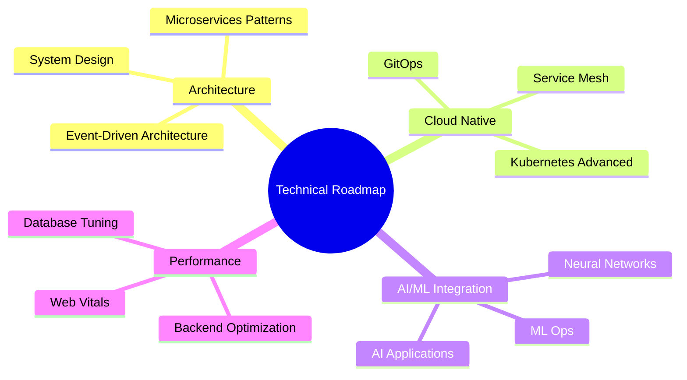
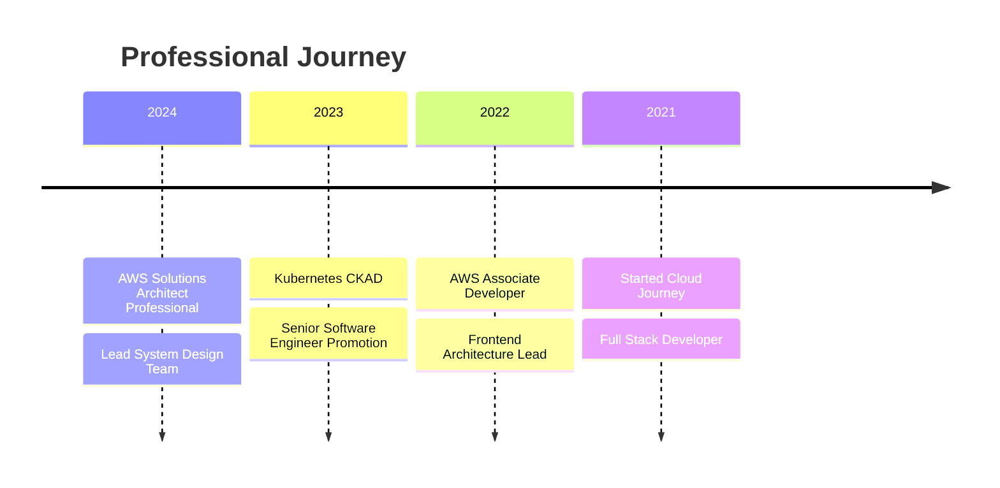

<div align="center">
  

  [](https://badges.pufler.dev)
  [](https://badges.pufler.dev)
  [](https://badges.pufler.dev)
</div>

## 💫 Professional Summary

```typescript
const techProfile = {
  role: "Senior Software Engineer",
  experience: "4+ years",
  mainStack: {
    frontend: {
      frameworks: ["React", "Next.js", "Vue.js"],
      stateManagement: ["Redux", "Zustand", "React Query"],
      styling: ["Tailwind CSS", "Styled-Components", "Material UI"],
      testing: ["Jest", "React Testing Library", "Cypress"]
    },
    backend: {
      languages: ["Node.js", "Python", "Java"],
      frameworks: ["NestJS", "Express", "Spring Boot"],
      databases: {
        sql: ["PostgreSQL", "MySQL"],
        nosql: ["MongoDB", "Redis"],
        orm: ["Prisma", "TypeORM"]
      }
    },
    devops: {
      containerization: ["Docker", "Kubernetes"],
      cicd: ["GitHub Actions", "Jenkins", "GitLab CI"],
      monitoring: ["Grafana", "Prometheus", "ELK Stack"]
    },
    cloud: {
      aws: ["EC2", "S3", "Lambda", "ECS", "RDS"],
      others: ["GCP", "Firebase", "Vercel"]
    },
    architecture: ["Microservices", "Event-Driven", "DDD", "CQRS"]
  },
  certifications: [
    "AWS Certified Solutions Architect",
    "Kubernetes CKAD",
    "HashiCorp Terraform Associate"
  ]
};
```

## 🛠 Technical Expertise

<details>
<summary>Frontend Development</summary>

### Core Technologies


### State Management & Data Fetching


### Styling & UI


### Testing


</details>

<details>
<summary>Backend Development</summary>

### Core


### Databases


### API


</details>

<details>
<summary>DevOps & Cloud</summary>

### Containerization & Orchestration


### CI/CD


### Cloud Platforms


</details>

## 📊 Development Metrics

<div align="center">
  
  
</div>

## 🎯 Technical Focus 2024



## 🚀 Featured Projects

<div align="center">
  <a href="https://github.com/hoangtuanphong1a/ecommerce-platform">
    
  </a>
  <a href="https://github.com/hoangtuanphong1a/microservices-architecture">
    
  </a>
</div>

## 📚 Latest Technical Blog Posts

<!-- BLOG-POST-LIST:START -->
- [Implementing Event-Driven Architecture with AWS EventBridge](https://dev.to/hoangtuanphong1a)
- [Advanced React Patterns for Enterprise Applications](https://dev.to/hoangtuanphong1a)
- [Microservices Monitoring with Prometheus & Grafana](https://dev.to/hoangtuanphong1a)
- [CI/CD Best Practices with GitHub Actions](https://dev.to/hoangtuanphong1a)
<!-- BLOG-POST-LIST:END -->

## 🏆 Certifications & Achievements



## 📫 Professional Network

<div align="center">

[](https://linkedin.com/in/yourprofile)
[](https://github.com/hoangtuanphong1a)
[](https://dev.to/yourprofile)

</div>

---

<div align="center">
  
</div>
